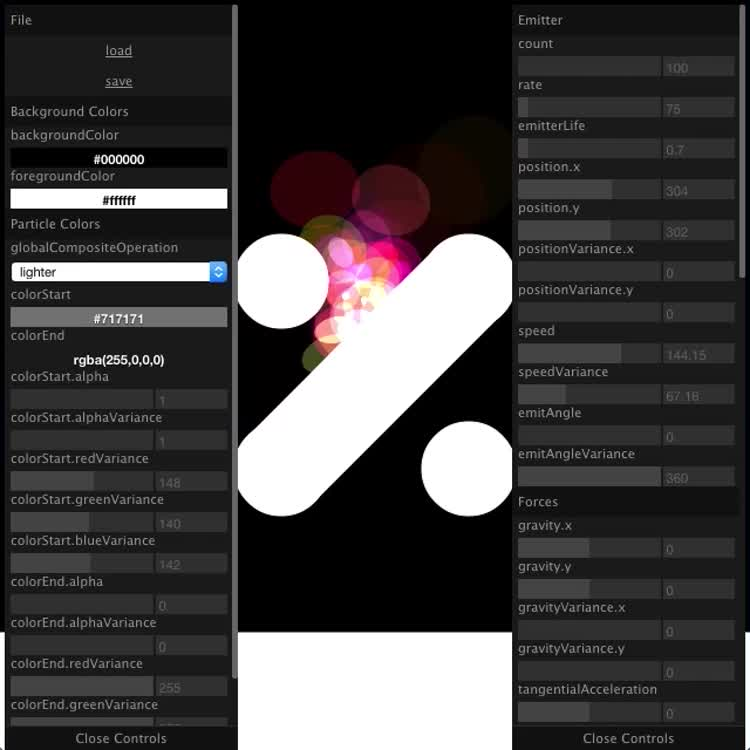

<gif poster="./particles_js-750.jpg" mp4="./particles_js-750.mp4" ratio="750:750">
</gif>
<hidden>
  
  
</hidden>

<image-caption>The particle system editor.</image-caption>

A particle system and editor I was working on.

Neat but not performant enough.
At high particle counts the kind of OOPish code I wrote it with doesn't work well.
To get it to work well with thousands of particles the code would have to be re-implemented in shaders.
