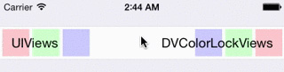

<gif poster="./dvcolorlockview.jpg" mp4="./dvcolorlockview.mp4" ratio="299:648" width="320">
</gif>
<hidden>
  
  
</hidden>

<image-caption>UITableViewCell highlighting does not change the color of DVColorLockViews.</small>
