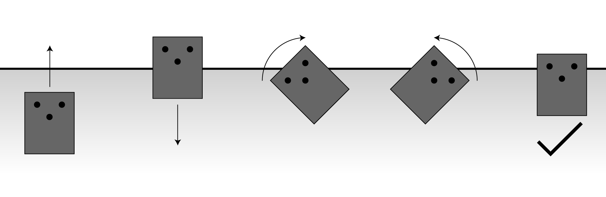

<image-caption>Detecting a stud and nailing the plywood sheet down.</image-caption>

The goal of the project was to create a robot that could nail down plywood sheeting on roofs.

The final product wasn't very polished. It was easy to think of how everything should work, it was much more difficult to actually build it and work out all the real world details.

## Components

- Raspberry PI to control all the other components.
- Motors with encoders to perform turns and go straight using PID control.
- Ultrasonic sensors to sense the roof edge and align with it.
- Stud finder to sense the joists.
- Linear actuator to press down the nail gun.
- Solenoid to trigger the nail gun.
- Coded mostly in python, using pigpio for things needing better performance like the encoders.

## Aligning with the Edge of the Roof

<image-caption>Preparing to put in the next row of nails. Turn, forward, turn, align, forward.</image-caption>

Using only the encoders to get ready for the next row would have led to an accumulation of error in the robots angle. A routine had to be created to align the robot with the edge.

<image-caption>Aligning routine states. The black dots are ultrasonic sensors. The line is the edge of the roof.</image-caption>

We used some ultrasonic sensors and a simple state based program to align it with the edge of the roof. This solution was cheaper and simpler than our other options: computer vision or a local positioning system.
