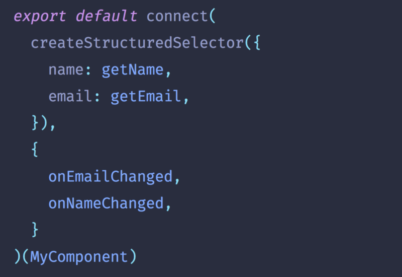

This is a tip to reduce boilerplate when writing redux code.

Here’s a typical implementation of a container:

```jsx
// MyContainer.js
import { connect } from 'react-redux'
import MyComponent from './MyComponent'

function mapStateToProps(state) {
  return {
    name: state.user.name,
    email: state.user.email,
  }
}

function mapDispatchToProps(dispatch) {
  return {
    onNameChanged: name => dispatch({ type: 'NAME_CHANGED', payload: name }),
    onEmailChanged: email =>
      dispatch({ type: 'EMAIL_CHANGED', payload: email }),
  }
}

export default connect(
  mapStateToProps,
  mapDispatchToProps
)(MyComponent)
```

This is how you can use shorthand and reselect to reduce the amount of code it takes (**less code less problems**):

```jsx
// MyContainer.js
import { connect } from 'react-redux'
import { createStructuredSelector } from 'reselect'
import MyComponent from './MyComponent'
import { getName, getEmail, onEmailChanged, onNameChanged } from './userReducer'

export default connect(
  createStructuredSelector({
    name: getName,
    email: getEmail,
  }),
  {
    onEmailChanged,
    onNameChanged,
  }
)(MyComponent)
```

**We use:**

- Selectors to grab our data out of reducers.
- Reselect to combine our selectors into a single selector.
- This single selector can be used directly in `mapStateToProps`.
- Action creators and `mapDispatchToProps` shorthand.
- We don’t declare functions for `mapStateToProps` and `mapDispatchToProps` since we know they’re the first arguments to connect.

You can see the code for this example on [DylanVann/redux-shorthand-example](https://github.com/DylanVann/redux-shorthand-example).
