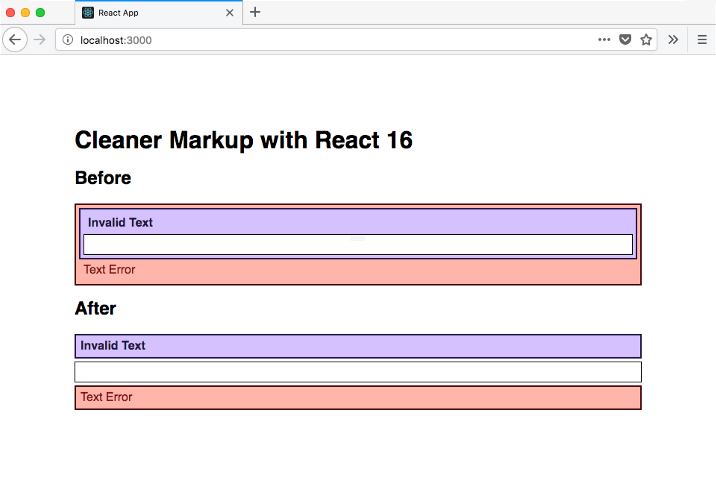

One of the new features in React 16 is that it allows you to return an array of components to render.

What is this useful for? Mostly for rendering cleaner markup. This will lead to a nicer looking DOM (for anyone looking), as well as slightly lighter payloads for SSR. It may also be useful in certain scenarios where the exact structure of the DOM is important.

Recently I’ve been working on creating accessible forms code. I’m aiming to make the components maximally composable, and aiming to keep the code as DRY as possible.

In trying to do this I’ve started using higher order components for adding errors, labels, and legends to the various form components. It ends up looking like this when writing a particular input that needs a label and inline error.

```jsx
// TextArea.js
import React from 'react'
import compose from './compose'
import withLabel from './withLabel'
import withError from './withError'

const TextArea = (props) => <textarea className="input" {...props} />

TextArea.displayName = 'Text'

export default compose(withLabel, withError)(TextArea)
```

The `withLabel` component looks like:

```jsx
// withLabel.js
import React from 'react'

export default (Base) => {
  const WithLabel = (props) => (
    <div>
      {!!props.label && (
        <label key="label" className="label" htmlFor={props.id}>
          {props.label}
        </label>
      )}
      <Base key="base" {...props} />
    </div>
  )
  WithLabel.displayName = `withLabel(${Base.displayName})`
  return WithLabel
}
```

It associates the label with the base component using the id prop and `htmlFor`.

The error component looks like:

```jsx
// withError.js
import React from 'react'

const errorId = (id) => `${id}-error`

export default (Base) => {
  const WithError = (props) => (
    <div>
      <Base
        aria-describedby={!!props.error ? errorId(props.id) : null}
        aria-invalid={!!props.error}
        {...props}
      />
      {!!props.error && (
        <span className="error" id={errorId(props.id)}>
          {props.error}
        </span>
      )}
    </div>
  )
  WithError.displayName = `withError(${Base.displayName})`
  return WithError
}
```

It associates the inline error with the base component by giving the base component an `aria-describedby` prop referring to the errors' id.
It also adds an `aria-invalid` prop if an error is present.

The markup rendered by the `Text` component with a label and error ends up looking like:

```html
<div class="error-container">
  <div class="label-container">
    <label class="label" for="invalid-textarea-before-id">Invalid Text</label>
    <textarea
      aria-describedby="invalid-textarea-before-id-error"
      aria-invalid="true"
      class="input"
      id="invalid-textarea-before-id"
    ></textarea>
  </div>
  <span class="error" id="invalid-textarea-before-id-error">Text Error</span>
</div>
```

Not very pretty. We’ve got a bunch of extra divs, and we have a bunch of nesting we don’t need.

In React 16 we can make our `withLabel` and `withError` components return arrays or fragments.
We will use the new JSX fragment syntax <></>.

Our HOC will now look like:

```js
// withLabel.js
import React from 'react'

export default (Base) => {
  const WithLabel = (props) => (
    <>
      {!!props.label && (
        <label className="label" htmlFor={props.id}>
          {props.label}
        </label>
      )}
      <Base {...props} />
    </>
  )
  WithLabel.displayName = `withLabel(${Base.displayName})`
  return WithLabel
}
```

After changing over withError the rendered markup will look like:

```html
<label class="label" for="invalid-textarea-id">Invalid Text</label>
<textarea
  class="input"
  aria-describedby="invalid-textarea-id-error"
  aria-invalid="true"
  id="invalid-textarea-id"
  label="Invalid Text"
  error="Text Error"
></textarea>
<span class="error" id="invalid-textarea-id-error">Text Error</span>
```

No wrapping divs, just exactly what we wanted rendered.

You can find the source for this at [DylanVann/react-cleaner-markup-example](https://github.com/DylanVann/react-cleaner-markup-example).
